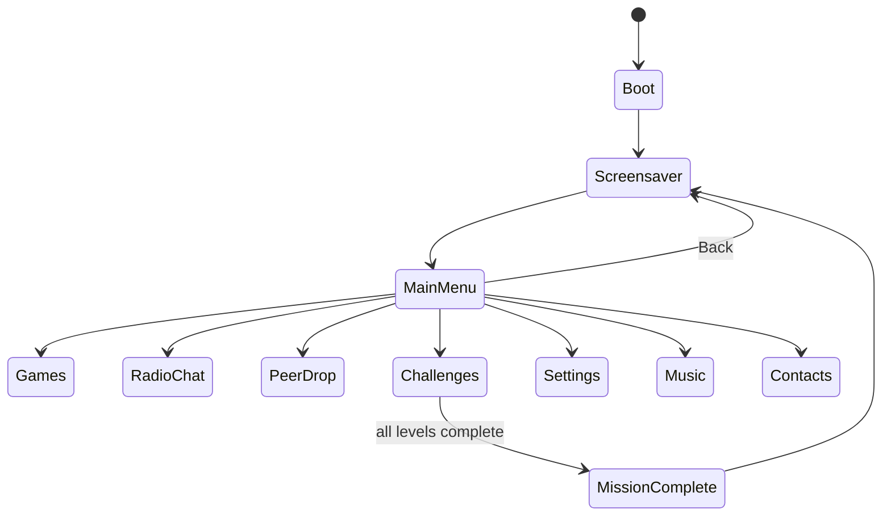

# Architecture

High-level system architecture. Per-subsystem detail lives in
[`docs/architecture/`](docs/architecture/); protocol-level detail lives in
[`docs/protocols/`](docs/protocols/).

## State management

`firmware/main/main.cpp` drives a single `AppState` state machine
(`firmware/include/state.h`). Exactly one screen is active at a time.
Every screen implements `enter()` (called once on transition in) and
`frame()` (called every tick, returning the next `AppState` — usually
itself, until it decides to transition). This is a uniform convention
across every feature: games, Radio Chat, PeerDrop, Settings, the
Challenge Framework, and the Screensaver home screen all follow it.

## Subsystem relationships

Alongside the screen state machine, a set of always-on subsystem managers
tick every loop iteration regardless of which screen is active:

- `led::` — addressable LED chain effects
- `audio::` — buzzer/melody playback
- `anim::` — shared animation helpers
- `power::` — battery monitoring
- `challenges::` — background challenge tasks (e.g. Level 1's UART leak,
  which broadcasts independent of the active screen)

Screens never talk to hardware drivers directly. They go through these
managers, and through the shared `ui::` renderer/widgets for drawing —
see [`docs/architecture/display-rendering.md`](docs/architecture/display-rendering.md).

## Challenge framework

See [`docs/architecture/challenge-engine.md`](docs/architecture/challenge-engine.md)
and [`docs/challenges/challenge-framework.md`](docs/challenges/challenge-framework.md)
for the registry-driven design, unlock chain, and persistence model.

## Communication framework

Radio Chat, Ship Battle, and the challenge arc's satellite link all sit
on top of a shared LoRa physical/link layer. PeerDrop is a separate BLE
(NimBLE) stack. See [`docs/protocols/`](docs/protocols/) for wire-level
detail and [`docs/architecture/lora-hardware.md`](docs/architecture/lora-hardware.md) /
[`docs/architecture/ble-subsystem.md`](docs/architecture/ble-subsystem.md)
for the hardware integration.

## Storage architecture

Identity, contacts, settings, and challenge progress persist in NVS. See
[`docs/architecture/storage-nvs.md`](docs/architecture/storage-nvs.md).

## Rendering flow

The display has no local framebuffer — every draw call is a direct SPI
write. Screens use a dirty-flag, direct-draw approach (redraw only what
changed) rather than a full-screen repaint every tick. See
[`docs/architecture/display-rendering.md`](docs/architecture/display-rendering.md).

## Event flow

Input is polled and debounced in software on top of a hardware RC filter
(`firmware/main/input/`). `loop()` must never block — no `delay()` calls
in the main path — since ESP-IDF's task watchdog monitors idle-task
starvation; timing-sensitive sequences (like the boot animation) are
`millis()`-gated instead of using blocking delays, so input polling stays
live throughout.
