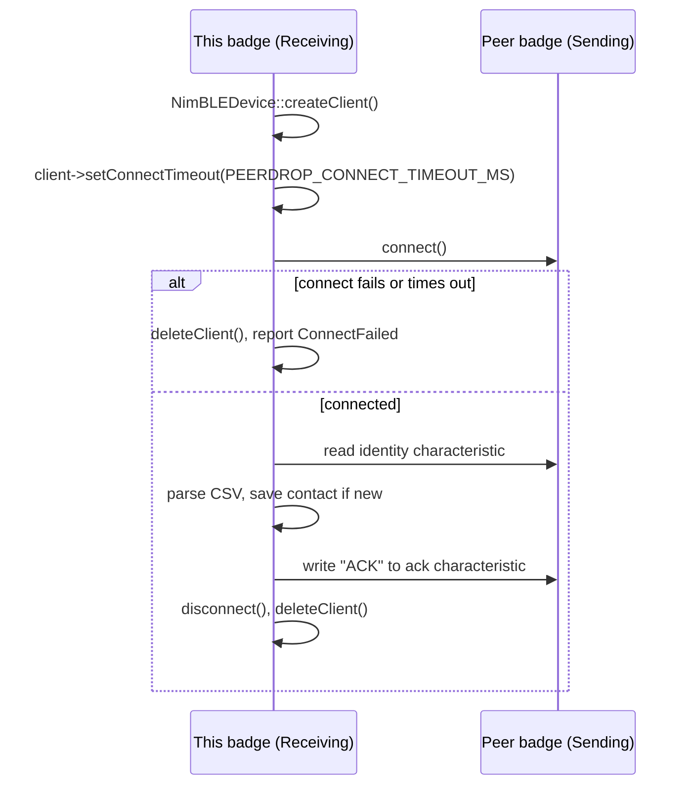

# BLE Subsystem

PeerDrop (`docs/protocols/peerdrop.md`) is the badge's only consumer of
Bluetooth Low Energy. This document covers the engineering considerations
around that integration: library choice, controller-memory initialization
order, connection lifecycle, and how LoRa and BLE usage are kept from
overlapping.

## NimBLE via h2zero/esp-nimble-cpp

PeerDrop is built directly on the standalone h2zero/esp-nimble-cpp component
(`#include <NimBLEDevice.h>`), rather than through the Arduino-ESP32 project's
own bundled BLE library or the NimBLE-Arduino wrapper package. This choice
has a concrete, documented interaction with Arduino-as-ESP-IDF-component
initialization that `firmware/main/main.cpp` calls out explicitly at the top
of the file: `arduino-esp32`'s `initArduino()` — which
`CONFIG_AUTOSTART_ARDUINO` runs automatically before `setup()` — frees the BLE
controller's memory region via `btMemRelease(BT_MODE_BLE)` whenever it
doesn't detect a BLE library it recognizes as linked. It only recognizes its
own bundled BLE library or NimBLE-Arduino (both of which include a specific
header to flag their presence to that check) — not the standalone
h2zero/esp-nimble-cpp component this project uses directly. Left unaddressed,
that memory gets freed and repurposed before `NimBLEDevice::init()` ever
runs, and the later `init()` call then corrupts the BT controller's internal
state trying to use memory that's no longer BLE's. `main.cpp` works around
this by including `esp32-hal-alloc-ble-mem.h` as its very first line, which
is what satisfies that detection check without actually depending on either
bundled library.

## Connection lifecycle

PeerDrop initializes the NimBLE stack — `NimBLEDevice::init()`, a single GATT
server with one service and two characteristics (identity, read-only; ack,
write-only), advertising, and a scanner — once per boot, on first entry into
PeerDrop, and never tears it down again for the remainder of that boot
session. Leaving PeerDrop only stops active scanning and advertising via
`stopBleActivity()`, not the underlying stack. The code notes this
deliberately: repeated `NimBLEDevice::deinit(true)` + `init()` cycles are a
known source of instability in NimBLE-Arduino integrations, where the BLE
controller does not reliably come back up clean after being torn down and
reinitialized. Keeping one long-lived stack instance and only starting/
stopping the lightweight scan/advertise operations avoids that class of
failure entirely.

Within a single PeerDrop session, the connection lifecycle for the active
("Receiving") side is:

`NimBLEClient::connect()` blocks the entire cooperative, single-threaded main
loop for as long as it runs — including `input::update()` — so PeerDrop
explicitly caps the connect timeout (`cfg::PEERDROP_CONNECT_TIMEOUT_MS`)
well below NimBLE's much longer default timeout, specifically so a failed or
slow connection attempt cannot freeze the badge's UI for an extended period.
This bounded-but-blocking behavior is also why the passive "Sending" side of
an exchange is freely cancellable with Back at any point (nothing of its own
is in flight), while the active "Receiving" side disables Back for the
duration of the connect/read/write sequence — interrupting a live
`NimBLEClient` mid-sequence risks leaving a dangling client object behind.

A version-specific API detail worth noting for anyone extending this code:
esp-nimble-cpp 2.x changed `NimBLECharacteristicCallbacks::onWrite()`'s
signature to add a `NimBLEConnInfo&` parameter (used here to identify which
peer address an ACK write came from), and made `NimBLEService::start()` a
no-op, since services now auto-start with the server. `scanTick()`'s
`NimBLEScanResults::getDevice()` also returns a pointer rather than a copy
under 2.x.

## LoRa/BLE mutual exclusivity

Vanguard's LoRa and BLE radios are logically independent hardware, but the
firmware's application architecture keeps them from being actively driven at
the same time. `main.cpp`'s `enterState()` stops any in-flight LoRa receive
(`rf::stopReceiving()`) before entering `AppState::Peerdrop`, so PeerDrop's
BLE session always starts with LoRa quiescent. The comment in `main.cpp`
frames this as "belt-and-suspenders" on top of an architectural guarantee
that already holds: the only code paths that actively poll or transmit on
LoRa run under `AppState::Challenges` (mission content) or
`AppState::RadioChat`/`AppState::ShipBattle` (`radiolink`), none of which can
be simultaneously active with `AppState::Peerdrop` in a single-state main
loop — but the explicit stop call removes any doubt about a stale RX window
overlapping a fresh BLE connection attempt.
