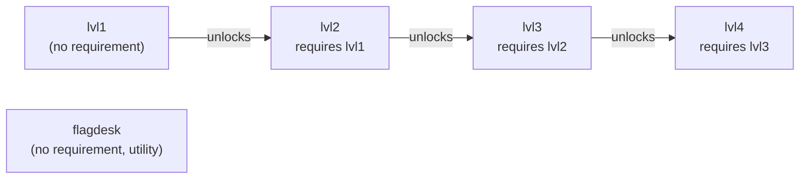

# Challenge Engine

The Challenge Engine is the framework underneath Vanguard's four-stage
Challenge content. It is deliberately split across three files with distinct
responsibilities, so that adding, removing, or rewording a stage never
requires touching the engine's own logic:

- **`challenge_data.h`** — the stage registry: pure, `const`, shared content.
- **`challenge_state.h`/`.cpp`** — mutable, per-badge, NVS-backed completion
  tracking.
- **`challenge_engine.h`/`.cpp`** — the reusable logic that turns "a stage
  was solved" into NVS writes, LED/audio feedback, and unlock/mission-
  complete bookkeeping.

This document covers the framework's architecture only — registry structure,
dispatch, unlock chaining, and progress persistence — not the content or
solve path of any individual stage.

## Registry-driven design

`challenge_data.h` defines `ChallengeStage`, a plain struct describing one
stage: a stable `id` (used as its NVS completion key and as the value other
stages reference via `requiresId`), display metadata (`name`, `category`,
`description`, `hint`, `reward`, `difficulty`), a `StageKind`, and a SHA-256
hash of that stage's flag (the hash is stored, not the flag itself, so a
flash dump cannot recover a flag directly). All stages are listed in one
`const` array, `kRegistry`, with `kStageCount` derived from its size. The
header's own comment states the intent directly: `challenge_data.h` is "the
only file needed to add/remove/reword a stage" — `challenges.cpp` and
`challenge_engine.cpp` are both written to dispatch on the registry
generically, never on a specific stage's identity.

## StageKind dispatch

`StageKind` enumerates the distinct *behaviors* a stage can have, not the
stages themselves — the doc comment is explicit that new values should be
added "as new stage behaviors are needed, not per stage." The kinds present
are: a static info/hint panel with no interactive or background logic; an
always-on background broadcast with no dedicated on-device screen; a
LoRa receive-and-forward flow paired with an on-device verification screen;
a USB-serial-driven authenticated exchange; a LoRa payload-receive-plus-
download flow; and a serial-driven flag submission utility that sits outside
the stage progression itself. Code that walks the registry (unlock
resolution, progress counting, completion) treats every stage generically
through its `kind` and other struct fields; only the screens implementing
each specific `StageKind`'s interactive behavior contain stage-specific
logic.

## Unlock chain

Each `ChallengeStage` carries `requiresId`: `nullptr` if the stage is always
unlocked, or the `id` of a stage that must already be completed first.
`challenges::isUnlocked(index)` resolves this by looking up the referenced
stage's completion state in NVS via `challenge_state::isCompleted()`. In the
shipped registry this forms a straight chain — each level requires the
previous level's `id` — but the mechanism itself is generic: any stage can
name any other stage's `id` as a prerequisite, and the utility flag-
submission entry has no requirement at all.

## Completion, progress, and persistence

Completion state lives entirely in `challenge_state.cpp`, a thin wrapper
around one NVS namespace (`cfg::NVS_NS_CHALLENGES`) keyed by each stage's
`id` as a boolean flag. Like the rest of the firmware's storage code (see
`docs/architecture/storage-nvs.md`), it opens that namespace read-write even
for reads, since a read-only open fails on a namespace that has never been
written to — true of every stage's flag on a fresh badge.

`challenge_engine::completeChallenge(id)` is the single entry point every
stage's solve path calls once its own logic decides the stage is solved. It
is idempotent — completing an already-completed stage is a silent no-op —
and on an actual new completion it: marks the stage complete in NVS, updates
the LED chain's persistent challenge-progress baseline
(`led::setChallengeProgress(completedCount())`), and plays a completion
sound/light cue. `completedCount()` walks the registry counting completed
stages, explicitly excluding the `FlagDesk` utility entry, since that entry
represents a submission tool rather than a stage of progress.

`challenge_engine::init()` (called once from `main.cpp`'s `setup()`) starts
any always-on background stage tasks — currently the `UartLeak` stage's
hidden broadcast — and restores the LED progress baseline from whatever
completion state NVS already holds, so progress display is correct
immediately after a reboot without waiting for a new completion event.
`challenge_engine::update()` runs every `loop()` tick regardless of
`AppState` (see `docs/architecture/system-overview.md`), specifically so a
background stage task keeps running even while the player is on an unrelated
screen.

## Mission-complete signal

When a completion brings `completedCount()` to `kStageCount - 1` (i.e. every
real stage except the `FlagDesk` utility entry), the engine latches a
one-shot pending flag. `main.cpp` polls `consumeMissionCompleteEvent()` on
every tick; the first tick it returns true, it force-switches `AppState` to
`MissionComplete` ahead of every other priority check in the main loop (see
`docs/architecture/system-overview.md`). The flag is guarded so it can only
fire once per full completion — `resetAll()` (testing/reset use only) clears
both every stage's completion flag and this guard, allowing a subsequent full
run to trigger the event again.
