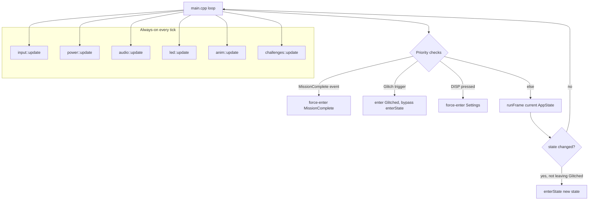

# System Overview

Vanguard's firmware (`firmware/main/main.cpp`, `firmware/include/state.h`) is
built around a single top-level state machine, `AppState`, and a small
cooperative main loop that ticks whichever state is currently active plus a
fixed set of subsystems that run regardless of state.

## AppState

`AppState` (`firmware/include/state.h`) enumerates every top-level screen or
mode the badge can be in:

```
Boot, Screensaver, MainMenu, Challenges, Peerdrop, GamesMenu, Tetris, Snake,
SpaceShooter, Game2048, MusicPlayer, Settings, ProfileSetup, Contacts,
RadioChat, ShipBattle, MissionComplete, Glitched
```

`Screensaver` is the permanent home screen — boot lands there, and every
major section's "Back all the way out" behavior returns to it. `ProfileSetup`
is deliberately a distinct state from `Settings`, not a boolean flag on it: a
normal entry into `Settings` must not re-run its `enter()` and reset a WiFi
Setup screen that was mid-flow back to its list view, so the Screensaver's
"PROFILE" shortcut targets a separate state value that happens to also route
into the Settings module. `MissionComplete` is a full-screen takeover once
every Challenge stage is finished; `Glitched` is a similar takeover triggered
by the "Badge Attack" feature, but unlike `MissionComplete` it resumes
whatever state it interrupted rather than replacing it.

## Screen convention: enter() / frame()

Every state maps to a module exposing two functions: `enter()`, called once
on transition into that state, and `frame()`, called once per main-loop
tick while that state is active and returning the `AppState` to be active
next tick (itself, to stay put, or a different value to transition).
`main.cpp` holds two switch statements, `enterState()` and `runFrame()`,
that dispatch to each module's `enter()`/`frame()` by `AppState` value —
for example `AppState::RadioChat` maps to `radiochat::enter()` /
`radiochat::frame()`, `AppState::Peerdrop` to `peerdrop::enter()` /
`peerdrop::frame()`, and so on for every other state.

`enterState()` does more than dispatch, though — it centralizes cross-cutting
setup/teardown that must happen on *every* transition, not just an explicit
Back press from within a screen:

- Stops any in-flight LoRa receive before entering PeerDrop, so a LoRa
  polling window can never overlap a BLE connection attempt (see
  `docs/architecture/ble-subsystem.md`).
- Calls `radiolink::end()` (idempotent) on every transition that is not
  *into* `RadioChat` or `ShipBattle`, so the shared radio-link layer always
  hands the radio back to its mission profile — including on forced
  transitions that skip a screen's own `frame()`-level cleanup entirely
  (the DISP shortcut, the `MissionComplete` takeover).
- Suppresses the persistent challenge-progress LED baseline while a game or
  Radio Chat is active, since each of those owns the LED chain for its own
  feedback.

Because forced transitions (the global DISP shortcut to Display Settings,
and the `MissionComplete` finale) jump straight to `enterState()` without
running the outgoing screen's own `frame()`, `main.cpp`'s `loop()` also stops
a fixed list of "known to leak if abandoned mid-session" resources
unconditionally before those forced transitions: audio playback, LED
effects, the WiFi Setup captive portal, and PeerDrop's BLE scan/advertising.
Each stop call is a no-op if that resource wasn't active.

## Always-on subsystems vs. screen-scoped state

`main.cpp`'s `loop()` ticks a fixed set of subsystem managers on every
iteration, independent of `AppState`:

```
input::update()      power::update()      audio::update()
led::update()        anim::update()       challenges::update()
console::pollConnection()
```

`challenges::update()` in particular keeps Challenge Level 1's hidden UART
leak transmitting regardless of what screen is on-display — it does not
touch the LoRa radio, which is instead only ever driven by whichever screen
currently owns it (mission content while `AppState::Challenges` is active;
`radiolink` while `RadioChat`/`ShipBattle` are active).

By contrast, screen-scoped state — the current menu selection, an in-flight
BLE exchange in PeerDrop, a chat message being composed in Radio Chat — lives
entirely inside that screen's own module and is only valid while that
`AppState` is active; it is (re)initialized by that module's `enter()`.



## Priority order in loop()

Within a single tick, `main.cpp` checks, in order: whether all Challenge
content has just been completed (highest priority — pre-empts any screen,
even mid-game); whether a "Badge Attack" glitch has just been triggered
(bypasses `enterState()` entirely, in both directions, specifically so it
does not tear down a live `radiolink` session or reset Radio Chat/Ship
Battle's own internal screen state); whether the global DISP shortcut was
pressed (from any state except `Settings`/`ProfileSetup` themselves); and
otherwise runs the current state's own `frame()`.

## setup() ordering

`setup()` performs a small number of steps in a specific, load-bearing order
before entering the main loop: it initializes/rechecks NVS, silences two
noisy ESP-IDF log tags that would otherwise flood the shared USB-CDC serial
console every few seconds, and — critically — calls `rf::deselect()` before
`display::init()` or anything else that drives the shared SPI bus. The TFT,
the LoRa module, and the LED shift registers all share the same MOSI/SCK
lines (see `docs/architecture/lora-hardware.md`); if the LoRa module's chip
select is left floating while the display issues its own SPI traffic, the
radio can wedge before `rf::init()` ever runs. `rf::init()` itself runs
before the boot animation, so the badge can report a dead radio immediately
rather than partway through mission content.

Finally, `loop()` ends with a 1-tick `delay(1)`: under ESP-IDF (as opposed to
classic Arduino-ESP32), the default task watchdog actively monitors the IDLE
task, and a loop that never yields at all risks a watchdog panic. The
1-millisecond delay is enough to let IDLE run without adding perceptible
input or render latency.
