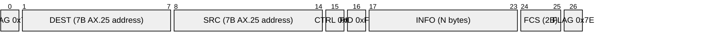
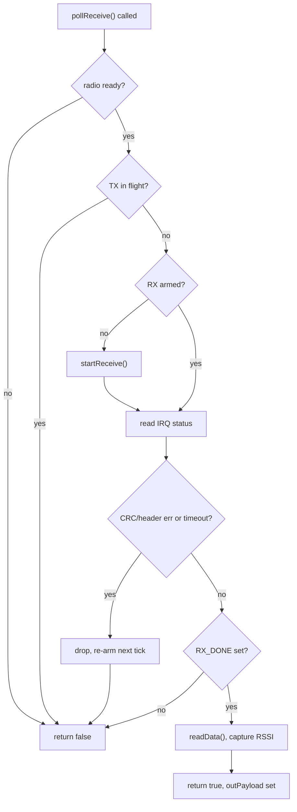

# LoRa Physical / Link Layer

Vanguard's mission and satellite-simulation content, plus the badge-to-badge
Radio Chat and Ship Battle applications, all ride over a single onboard LoRa
radio. This document describes that radio's driver integration and the
AX.25-style framing every LoRa packet on the badge uses. Higher layers
(badge-to-badge addressing, reliability, discovery) are covered separately in
`docs/protocols/radio-chat.md`.

## Radio hardware and driver

The badge carries an RA-01SC module. Its silkscreen and datasheet identify it
as an LLCC68, but the chip actually populated on this hardware answers
RadioLib's version-string probe as an SX1261, and the firmware drives it
through RadioLib's `SX1261` class accordingly (`firmware/main/rf/lora.cpp`).
One practical consequence of the SX1261 identity is a lower output-power
ceiling than the LLCC68 (14 dBm vs. 22 dBm); the firmware's default transmit
power is comfortably under that limit.

RadioLib talks to the module through a custom HAL (`EspHal`,
`firmware/main/rf/EspHal.h`/`.cpp`) rather than the stock Arduino HAL. `EspHal`
implements SPI transfers via ESP-IDF's `spi_master` driver, GPIO through the
native `driver/gpio.h` API, and microsecond-accurate timing via
`esp_rom_delay_us()`. The SPI link runs at 2 MHz, MSB-first, mode 0, and the
HAL reapplies those settings on every transaction so the shared bus's other
users (see below) can't leave it in a different configuration.

The radio's SPI bus (NSS/MOSI/MISO/SCK) is shared with the badge's TFT
display and its LED shift registers — see `docs/architecture/lora-hardware.md`
for the pin map and the operational implications of that sharing, including
the fact that the module's RESET line is not wired to a GPIO at all.

## Frame format

`firmware/main/rf/frame_codec.h`/`.cpp` implement an AX.25-style UI-frame
encoder/decoder. The two endpoints of the mission/satellite link use fixed,
fictional callsigns (not real amateur-radio identifiers) so a generic AX.25
decoder cannot identify the protocol on inspection alone.

A frame is transmitted as an ASCII hex string — the hex digits themselves are
the literal payload handed to `rf::transmit()`, not a raw binary packet. Its
byte layout is:

Field notes:

- **FLAG** — `0x7E` at both start and end of the frame.
- **DEST / SRC** — 7-byte AX.25-style address fields. Each encodes up to a
  6-character callsign, space-padded, with every character shifted left one
  bit; the seventh byte packs an SSID nibble plus an address-extension bit.
  The extension bit is set (`last = true`) on whichever address is acting as
  the frame's source, since these frames never carry digipeater addresses.
- **CTRL** — fixed `0x03`, the AX.25 UI-frame (unnumbered information)
  control value.
- **PID** — fixed `0xF0` (no layer-3 protocol) for mission/satellite traffic.
  The badge-to-badge link layer described in `radio-chat.md` uses a distinct
  PID (`0xBB`) inside the same outer frame so the two traffic types never
  cross-parse.
- **INFO** — the payload, N bytes, hex-encoded like the rest of the frame.
  For mission/satellite content this begins at a fixed hex offset (34 hex
  characters into the string, i.e. 17 fixed header bytes) and ends 6 hex
  characters (3 bytes: FCS + closing flag) before the end of the string.
- **FCS** — a 2-byte field. `frame_codec` computes it as a plain 16-bit
  additive checksum over CTRL, PID, and every address/INFO byte — it is
  explicitly not a cryptographic integrity check, and the LoRa radio's own
  hardware CRC is what actually discards corrupted-in-flight packets before
  `parseFrame()` ever sees them. `parseFrame()` (used by mission/satellite
  code) does not validate the FCS at all; `verifyFcs()`, a separate function,
  does, and is used only by the badge-to-badge link layer.

`frame_codec` also exposes `xorInPlace()`, a single-byte XOR used by mission
content to obscure some packets, and `isPrintableAscii()`, a helper mission
screens use to distinguish plaintext packets from XOR-obscured ones without
otherwise decoding them.

## Self-test, transmit, and non-blocking receive

`rf::init()` first attempts a wake sequence (see `lora-hardware.md`) and then
calls RadioLib's `begin()` with the badge's fixed mission profile (frequency
from `cfg::LORA_FREQUENCY_MHZ`, 125 kHz bandwidth, spreading factor 9, coding
rate 4/7, private sync word, 10 dBm, 8-symbol preamble). If the first `begin()`
fails and the wake sequence had reported the chip ready, it retries once — a
concession to SX126x-family errata where a marginal first `begin()` can
succeed on a second attempt. `rf::selfTest()` simply reports whether that
initialization succeeded, and is what the Settings Hardware Test Suite calls
to confirm SPI/chip presence.

`rf::transmit()` is a blocking send: it hands the payload to RadioLib's
`transmit()` and returns only once the call completes. Every mission/satellite
screen uses this path.

`rf::pollReceive()` is non-blocking and designed to be called once per frame
tick from the main loop. It arms continuous receive on first use, then
inspects the SX126x's IRQ status register on each call:

Deliberately absent from this path is any per-packet logging: printing to the
115200-baud serial console on every tick or every packet costs enough
blocking I/O time to make the radio miss back-to-back packets while it's out
of RX. A narrower diagnostic print exists for CRC/header-error/timeout IRQ
bits specifically (excluding `PREAMBLE_DETECTED`, which fires on nearly every
packet heard and would otherwise reintroduce the same cost), so genuine
radio-level activity that never resolves into a clean packet is still
visible without paying that cost on every normal receive.

`rf::stopReceiving()` takes the radio out of RX and into standby; it is used
to guarantee the LoRa radio is quiescent before a BLE session (PeerDrop)
starts, since BLE and the SPI-driven LoRa radio should not be contending for
attention at the same time.

## Profiles, non-blocking transmit, and channel sensing

Beyond the original blocking transmit/polling-receive pair, the radio driver
exposes a small set of additions used specifically by the badge-to-badge link
layer (`radiolink`, see `radio-chat.md`):

- **Profiles** — `rf::Profile` bundles frequency, bandwidth, spreading
  factor, coding rate, power, and preamble length. `kMissionProfile` is the
  same configuration `init()` already establishes; `kBadgeLinkProfile` is a
  distinct configuration (433.7 MHz, SF7/CR 4:5) chosen so it cannot
  physically collide with mission/satellite traffic on a different frequency,
  and so its airtime cost is substantially lower than the mission profile's
  SF9. `rf::applyProfile()` puts the radio into standby, reconfigures every
  field, and reverts to the previous profile on any failure.
- **Non-blocking transmit** — `beginTransmit()` starts a transmit and returns
  immediately (SPI write time only, not full time-on-air); callers poll
  `txComplete()` and then call `endTransmit()`, or give up once a
  caller-computed deadline (based on `airtimeMs()`) has passed in case the
  radio never raises TX_DONE.
- **Channel sensing** — `channelBusy()` performs a short SX126x CAD (a few
  symbol times) as a listen-before-talk check. It leaves the radio in
  standby afterward and reduces near-neighbor collisions, but it cannot
  detect a packet already mid-payload and does nothing for hidden-terminal
  scenarios.
