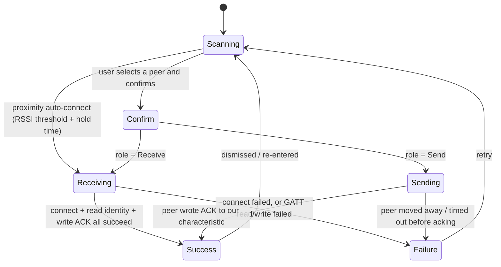

# PeerDrop — BLE Proximity Contact Exchange

PeerDrop (`firmware/main/peerdrop/peerdrop.cpp`) is a Bluetooth Low Energy
contact-exchange feature built on NimBLE (via the `NimBLEDevice` Arduino
wrapper). Two badges in range of each other can discover one another,
confirm an exchange direction, transfer identity information over GATT, and
persist the result as a saved contact.

## Advertised name and discovery

Each badge advertises with a BLE device name built from a fixed prefix
followed by the user's identity name (truncated to 8 characters), and
scans for other devices advertising that same prefix. This is the only
mechanism PeerDrop uses to recognize another badge — the GATT service UUID
is deliberately *not* included in the advertisement payload, both to save
advertising-payload space and because full service discovery only needs to
happen after a connection is already established.

A scan result is added to the peer list once it: carries a BLE name with the
expected prefix, and reports RSSI at or above a configured threshold
(`cfg::PEERDROP_RSSI_THRESHOLD_DBM`). Each known peer's RSSI and last-seen
timestamp are refreshed on every subsequent sighting; peers not seen for 5
seconds are pruned from the list. The BLE stack itself (`NimBLEDevice::init()`
and the GATT server/service/characteristics) is initialized once per boot and
never torn down between PeerDrop sessions — the code notes that repeated
`deinit()`/`init()` cycles are a known source of NimBLE-Arduino instability —
so entering and leaving PeerDrop only starts and stops scanning/advertising.

## GATT layout

PeerDrop runs one GATT service with two characteristics:

- an **identity characteristic** (read-only) whose value is the local
  badge's identity, packed as a comma-separated string (name, email, phone,
  organization);
- an **ack characteristic** (write-only) that a connecting peer writes the
  literal string `"ACK"` to, once it has finished reading the identity
  characteristic.

## Exchange flow

A user manually selects a peer from the scan list and chooses a direction
(Receive or Send) on a confirm screen, or — if a peer is close enough (RSSI
at or above `cfg::PEERDROP_AUTO_CONNECT_RSSI_DBM`, sustained for a
configured hold time, or instantly for RSSI at or above a "touching"
threshold) — the exchange auto-fires as a Receive without the confirm step.
Auto-connect always means Receive: proximity is treated as a convenience for
pulling the other badge's contact quickly, not as an implicit decision to
share this badge's own identity. Because the choice is per-badge and
unilateral, two badges held close together can each independently
auto-fire their own Receive and end up with a mutual exchange without any
coordination between the two sides.

- **Receiving** — this badge is the active side: it connects out to the
  peer, reads its identity characteristic, saves a new contact (skipping the
  save if that MAC is already a known contact — the handshake and ack still
  run either way, since the exchange is not assumed to be mutual), and
  writes `"ACK"` to the peer's ack characteristic.
- **Sending** — this badge is passive: it waits, still advertising and
  connectable, for the chosen peer to connect, read its identity
  characteristic, and write `"ACK"` back. Reaching `Success` on this side
  depends on the ack characteristic's write callback firing with the
  connecting peer's address matching the badge that was selected.
- **Failure** carries a specific reason (`Timeout`, `PeerMovedAway`,
  `ConnectFailed`, `TransferInterrupted`) so the UI can show something more
  specific than a generic connection error.

Because a live BLE connect/read/write sequence on the Receiving side is a
short, bounded operation — capped by `PEERDROP_CONNECT_TIMEOUT_MS` rather
than NimBLE's much longer default connect timeout, specifically so it cannot
freeze the badge's cooperative single-threaded main loop — the Back button is
disabled only during that phase, to avoid leaving a dangling client object
behind a cancelled connection attempt. The passive Sending phase has nothing
of its own in flight and can be cancelled immediately.

## Contact persistence

A successful Receive stores a `storage::Contact` record (the peer's BLE MAC
address plus its unpacked identity fields) via the storage layer's contact
list, which is backed by NVS and survives reboots (see
`docs/architecture/storage-nvs.md`). This same contact store is also what
`radiolink` (`docs/protocols/radio-chat.md`) matches discovered LoRa peers
against, using the last three octets of a contact's MAC to associate a
badge's short link ID with a saved name.
