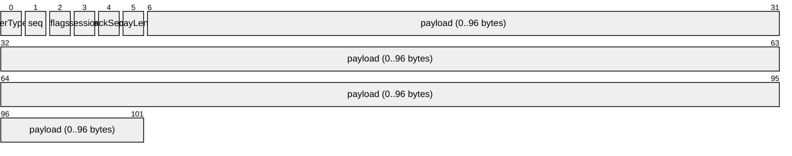
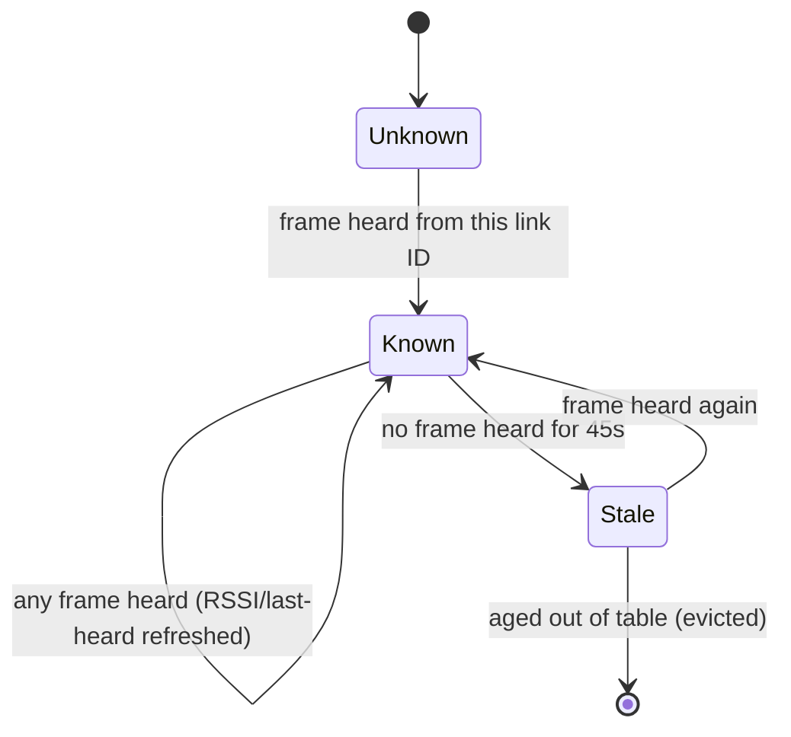
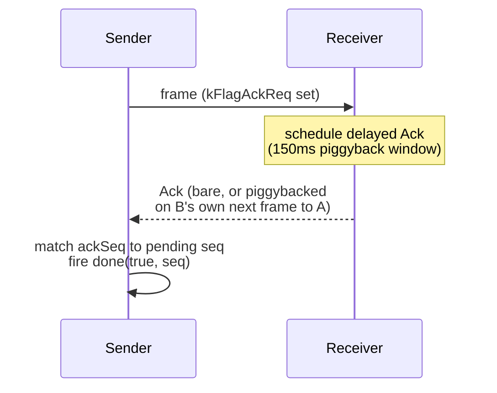

# Badge-to-Badge Link Layer (Radio Chat / Ship Battle)

`radiolink` (`firmware/main/rf/radio_link.h`/`.cpp`, wire format defined in
`firmware/main/rf/radio_link_types.h`) is a shared link layer sitting between
the raw LoRa driver (`docs/protocols/lora.md`) and two applications: Radio
Chat and Ship Battle. It provides addressed, deduplicated messaging with
optional reliable delivery, plus passive peer discovery, without either
application needing to know anything about LoRa, spreading factors, or
AX.25-style framing.

Exactly one caller may be active at a time. `main.cpp`'s state transition
logic calls `radiolink::end()` on every transition away from
`AppState::RadioChat`/`AppState::ShipBattle`, restoring the radio to its
mission profile.

## Layering

`radiolink` rides inside the INFO field of the same AX.25-style frame used by
mission/satellite traffic (`frame_codec`), using a distinct PID (`0xBB`,
versus `0xF0` for mission content) so the two never cross-parse. The
DEST/SRC address fields are built the same way mission traffic builds them,
but with a badge's 6-hex-digit "link ID" as the callsign and a dedicated SSID
nibble (`kSsidBadgeLink = 1`) as the service selector — this is what lets a
receiver tell badge-link traffic apart from mission/satellite traffic sharing
the same address-field mechanism. Other SSID values are reserved:
`kSsidMission` (0) and `kSsidSatellite` (7) are the pre-existing mission
traffic, and `kSsidPiGateway` (2) is reserved for a possible future ground
relay node.

Addressing a message to every badge in range uses a fixed broadcast callsign
(`radiolink::kBroadcastId`) rather than a real link ID; it is deliberately
built from letters that cannot appear in a valid 6-hex-digit link ID, so it
can never collide with a real badge's address.

## INFO sub-header

Inside the frame's INFO field, `radiolink` prepends its own fixed 6-byte
sub-header before the application payload:

- **verType** — top 3 bits are a protocol version (`kVersion = 1`); bottom 5
  bits are the message `Type`. The version check lets an older badge ignore a
  future protocol revision cleanly rather than misparse it.
- **seq** — per-sender sequence number, incremented once per new message
  (not on retries), wrapping 255 → 0.
- **flags** — a bitmask: `kFlagAckReq` (sender wants an ack for this seq),
  `kFlagIsAck` (this frame's `ackSeq` field is meaningful — either a bare Ack
  message or an ack piggybacked on any other outgoing frame), `kFlagRetry`
  (this is a retransmission of the same seq, not a new message),
  `kFlagAuth` (Ship Battle only — the last two payload bytes carry a
  truncated session MAC), and a 2-bit `kFlagHopMask` reserved for a possible
  future relay hop count.
- **session** — 0 for sessionless traffic (Radio Chat never opens a session
  and always sends session 0); otherwise an application-chosen game/
  conversation identifier used by Ship Battle.
- **ackSeq** — the `seq` being acknowledged; only meaningful when
  `kFlagIsAck` is set.
- **payLen** — the payload byte count that follows. This duplicates
  information already implied by the outer frame's INFO length, deliberately:
  `frame_codec::parseFrame()` truncates an oversized frame rather than
  rejecting it, so a mismatch between `payLen` and the actual remaining bytes
  is `radiolink`'s way of catching that truncation instead of silently
  parsing partial data as valid.
- **payload** — 0 to `kMaxPayload` (96) bytes, whose meaning depends on
  `Type`. Message types cover link housekeeping (`Beacon`, `BeaconReq`,
  `Ack`, `Ping`, `Bye`), chat content (`TextMsg`, `MorseMsg`), and Ship
  Battle's own game messages (`HostAdv`, `JoinReq`, `JoinAccept`,
  `JoinReject`, `FleetReady`, `Fire`, `FireResult`, `GameSync`, `GameOver`,
  `Forfeit`).

A received frame is only handed to the application once it has passed a full
validation ladder: the outer frame parses, its PID and SSID nibbles match
badge-link traffic, its FCS verifies, the sub-header is internally
consistent, its protocol version is recognized, it's addressed to this badge
or to the broadcast address, and — if a session is open — its session field
matches that session. Link-internal types (`Ack`, `Ping`, `Beacon`,
`BeaconReq`) are consumed inside `radiolink` itself and never delivered to
the application.

## Peer discovery

Badges advertise their presence with periodic `Beacon` frames (broadcast,
carrying a display name and an application-defined capability byte). Any
badge that hears a frame from another badge — a beacon or otherwise — records
or refreshes that badge in a table of up to 24 peers, tracking its link ID,
last-seen RSSI, last-heard timestamp, and (if it matches a stored PeerDrop
contact by Bluetooth MAC) that contact's saved name.

`peerCount()` sorts the table by descending RSSI, then by name, before the
caller iterates it with `peerAt()` — so a contact picker naturally lists the
strongest, most nearby signals first. Beaconing paces itself adaptively: an
18-second idle interval normally, tightened to 5 seconds (plus a one-shot
`BeaconReq` "poke" asking nearby badges to beacon immediately) when a caller
opens `requestScan()` — typically while a contact-picker screen is open and a
user is actively waiting to see who's nearby. Beaconing is automatically
suspended while a session is open, since a live exchange with a specific peer
already establishes presence. If the peer table reaches its 24-entry cap, the
least-recently-heard entry is evicted to make room for a new one.

## Reliable delivery

`sendUnreliable()` is fire-and-forget — no ack requested, no retries — and is
what beacons and broadcast chat messages use, since a broadcast recipient
pool can't all ack one sender. `sendReliable()` is a single-slot, ack-tracked
send: only one reliable send may be outstanding at a time (a bigger window
buys nothing, since a single physical radio can only have one frame on air
regardless), and it returns `Busy` if one is already pending.

A receiver that owes an ack does not always send a bare `Ack` frame
immediately: it waits up to 150 ms in case it has its own outgoing frame to
the same sender in that window, in which case the ack rides along as a
piggyback (`kFlagIsAck` + `ackSeq` on that outgoing frame) instead of costing
a separate transmission. If nothing else goes out in that window, a bare Ack
is sent.

If no ack (bare or piggybacked) arrives before the retry deadline, the sender
retransmits the same sequence number with `kFlagRetry` set. The retry
deadline is a base of 800 ms, scaled by the attempt number plus a small
random jitter, and the delivery attempt is abandoned after 4 total attempts
(1 original + 3 retries) — at which point `sendReliable()`'s completion
callback fires with `acked = false`. A duplicate frame (same sender, same
seq, already seen) is still re-acked even though it isn't re-delivered to the
application, since a duplicate almost always means the receiver's previous
ack was lost rather than that the sender is confused.

Beyond acked delivery, `radiolink` runs a small housekeeping loop on every
`update()` call: it drains one received frame per tick, pumps any in-flight
transmit to completion, retries or times out a pending reliable send, sends
an idle `Ping` if a session has been silent for 8 seconds, fires beacons on
schedule, and ages out stale peers roughly once a second. Every message this
layer transmits or receives also passes through a small deduplication window
(the last 48 distinct sender/seq pairs) so a retransmitted frame is never
delivered to the application twice, even if its ack was the thing that got
lost.
