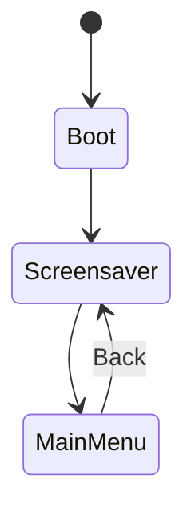

# Architecture

See [`ARCHITECTURE.md`](../ARCHITECTURE.md) in the repository root for the
full write-up. Summary:

## System design

`main.cpp` drives a single `AppState` state machine — exactly one screen
active at a time, each implementing `enter()`/`frame()`. Always-on
subsystem managers (`led::`, `audio::`, `anim::`, `power::`,
`challenges::`) tick every loop iteration regardless of the active
screen.

## State flow

Every feature screen hangs off `MainMenu` and returns to it (or to
Screensaver directly) on Back.

## Subsystem relationships

Screens never touch hardware drivers directly — they go through subsystem
managers and the shared `ui::` renderer/widgets. See
[`docs/architecture/`](../docs/architecture/) for per-subsystem detail:
system overview, LoRa hardware integration, BLE subsystem, display
rendering, NVS storage, and the challenge engine.
